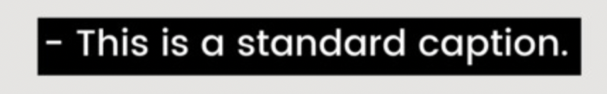
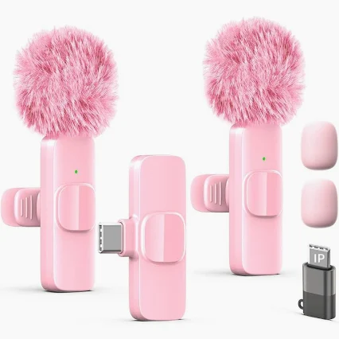
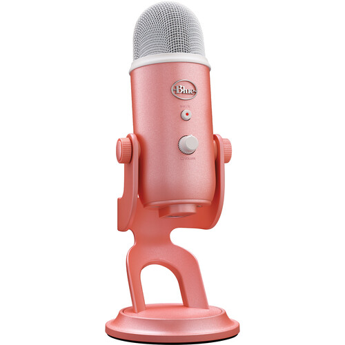
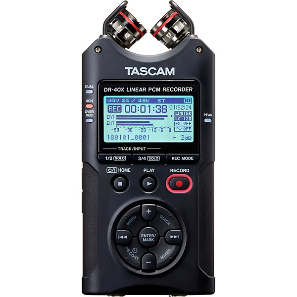
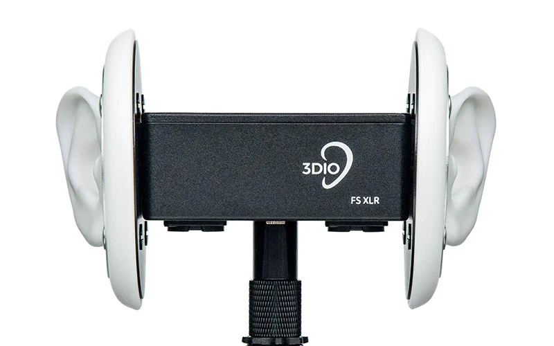

# 🎙️ For ASMRtists
*Create, share, and connect*

[← Back to Home](index.md)

---

## Contents
- [💜 ASMR For and By the Disabled Community](#-asmr-for-and-by-the-disabled-community)
- [Community Rules](#community-rules)
- [Resources for ASMRtists](#resources-for-asmrtists)
- [Contribute Your Video](#contribute-your-video)
- [Join the Network](#join-the-network)
- [ASMRtist Spotlight Stories](#asmrtist-spotlight-stories)

---

## 💜 ASMR For and By the Disabled Community

At Tingle Space, we believe ASMR should be **created and enjoyed by everyone** — including people with disabilities. We actively welcome and celebrate disabled ASMRtists and creators.

**What this means for Tingle Space:**
- We follow the 10 principles of [disability justice](https://sinsinvalid.org/10-principles-of-disability-justice/). 
- We prioritize featuring disabled creators in our spotlight stories
- We provide resources specifically for creating ASMR with different abilities
- We advocate for captions, audio descriptions, and sensory-friendly content
- We listen to the disabled community on what accessibility actually means

> *"Nothing about us without us."*

## Community Rules

Making ASMR accessible means everyone can enjoy your content — regardless of hearing ability, sensory sensitivities, or how they experience ASMR.

- Add captions to all your videos.
  *Normally a standard caption will look like this: with black background and white font (make sure it's Sans-serif!)*
  
  [→ Detailed guildline for a CC](https://www.3playmedia.com/blog/closed-caption-styling-formatting-best-practices-you-need-to-know/)
  

  
- In your video description, describe visual elements for viewers with visual impairments.

- Include content warnings for intense sounds or visuals (e.g. crinkling, bright lights)

  
- Label your triggers clearly in the title and description

  
- Avoid sudden loud sounds without warning

  
- Be mindful of sensory overload — offer gentle, varied pacing

  
- Respect all forms of ASMR — tingles look different for everyone
  

---

## Resources for ASMRtists

Don't know where to start? We've got you.

- How to record your first ASMR video — beginner's guide

- Best microphones for every budget — gear recommendations
  
  1.[Tiny microphones (~ $30) - perfect for lo-fi!](https://www.amazon.com/tiny-microphone/s?k=tiny+microphone)
  
  
  
  2.[The classic Blue Yeti (~ $70)](https://www.amazon.com/s?k=blue+yet&crid=3AG3RGOEYNC7Q&sprefix=blue+yet%2Caps%2C191&ref=nb_sb_noss_2)
  
  
  
  3.[Tascam (~ $200) - portable and good sounds!](https://www.amazon.com/s?k=tascam&crid=4TI0HEWF2P0D&sprefix=tascam%2Caps%2C203&ref=nb_sb_noss_1)
  
  
  
  4.[3Dio mic ($200 - $2,000) - ears-like, and can really catch the sounds](https://3diosound.com/collections/microphones?srsltid=AfmBOopiVMv1eFaCBTW4hfdOJHUyBsswxkvsomGc1n1yD_9sSp6QR8wh)
  
  
  
  5.Bear in mind that we are Tingle Space - actually, whatever gears you like can work. And there will always be people who enjoy your videos! <3

- Free editing tools — software to get started
  
  - CapCut — auto-captions built in, beginner friendly

    
  - iMovie — free for Mac users

    
  - DaVinci Resolve — free, professional grade

    
  - YouTube Studio — auto-captions your videos for free: [Official learning series](https://www.youtube.com/playlist?list=PL_dhPga7ruueWf2DcWvnp3Y9zj-sbZtss)
    
    
- How to write accessible video descriptions
  
  - Start with a one-sentence summary of what happens in the video
    
  - List all triggers clearly (e.g. tapping, whispering, crinkling)
    
  - Mention any bright lights, sudden sounds, or intense visuals as warnings
    
  - Include a full transcript or link to one
    
  - Describe the visual setting (e.g. "soft lighting, close-up hand movements")
    
  - Note the language spoken and whether captions are available
    
  - Add timestamps for different sections so viewers can skip around

---

## Contribute Your Video

We'd love to feature your work! Submit your ASMR video to the Tingle Space collection.

**What we look for:**
- Captions or transcript included
- Triggers clearly labeled
- Content is welcoming and inclusive
- Any format welcome — whispering, tapping, nature sounds, visual ASMR, and more

[→ Submit your video here](https://forms.gle/HcwPGeAmeMHPrfgw7)

---

## Join the Network

See where fellow creators are based and find collaborators near you.

- View the ASMRtist map
- Add yourself to the map — share your name, location, and channel link

[Join the map](https://www.google.com/maps/d/edit?mid=1b-QKgTSsk3Mh-VM15j8FfD1wlgVENng&usp=sharing)

---

## ASMRtist Spotlight Stories

Meet the ASMRtists making ASMR more accessible for everyone.

- Spotlight #1 — coming soon
- Spotlight #2 — coming soon
- Want to be featured? [Apply here](https://forms.gle/fT3SGNx1tVo7YmjG6)

---

[← Back to Home](index.md)

*Tingle Space — ASMR for every mind. Made with care. 🤎*
